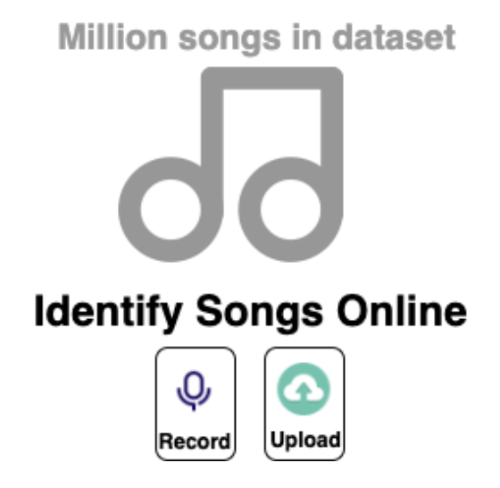
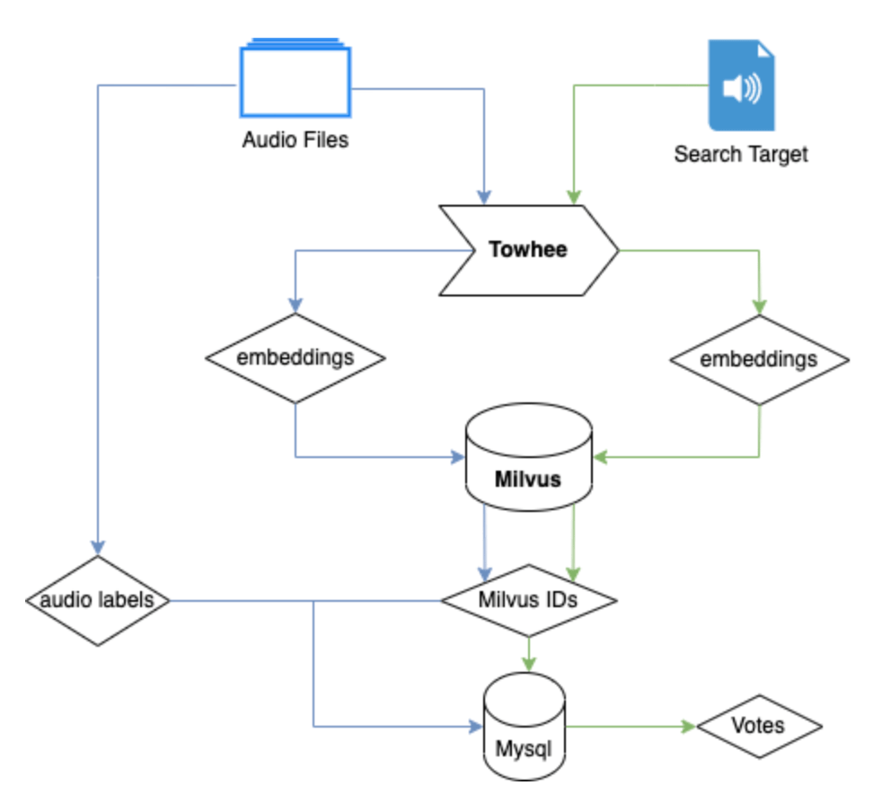

### Overview

A music recognition system automatically identifies a piece of music by matching a short snippet against a database of known music. Compared to the traditional methods using frequency domain analysis, the use of embedding vectors generated by 1D convolutional neural networks improves recall and can, in some cases, improve query speed.



### Key technologies

##### Preprocessing

Neural network based music embedding solutions often require the input audio to be of a specific format and length. Similar to preprocessing images for use in neural networks, preprocessing music (and other audio) involves transformations such as converting file types, splitting into fixed-length crops, changing sample rates, and denoising. The final representation of the audio data is a numpy array.

```python
>>>
```

##### Encoder-based embedding model

The embedding model is used to convert audio into embeddings. Music recognition requires a model that is invariant to changes in pitch and noise, making an encoder-based model an obvious candidate (our [image deduplication application](scenarios/image-deduplication) also uses such a model). Towhee makes it incredibly easy to compute audio embeddings, given transformed data:

```python
>>> from towhee import pipeline
>>> embedding_pipeline = pipeline('music-encoder')  # instantiate the pipeline
```

##### Vector database

The system requires a proper database to store and retrieve vectors; when dealing with a massive quantity of vectors, flat/naive search is very slow. It is necessary to have a vector database that can build indexes to reduce search latency all while handling storage and persistence.

For this step, we use [Milvus](https://milvus.io), a state use a state-of-the-art vector database that can support billions of vectors. It also allows users to build indexes in order to speed up the querying process. Given a list of audio files, we can preprocess, embed, and store the results within Milvus as follows:

```python
>>>
```

### Putting it all together

A music recognition system generally transforms audio data to embeddings and compares similarity based on distances between embeddings. Therefore, an encoder converting audio to embedding and a database for vector storage and retrieval are main components.



The above picture is a brief system architecture of a music recognition system based on Towhee and Milvus. It transforms audio dataset to vectors with a Towhee audio embedding pipeline and then insert all vectors into Milvus. Since Milvus does not yet support string data, the 1-to-1 mappings between audio files and embedding vectors are stored in an auxiliary relational database.

During querying, the audio is preprocessed as in the music embedding model; all results of the preprocessing step are passed into Milvus as search targets. The output vector IDs are then fed into the relational database (MySQL), which returns a list of the most probable music.

```python
>>>
```

### Resources

In the music recognition system, audio fingerprints can be extracted through a Towhee pipeline. We provide a list of different music embedding pipelines [here](pipelines/music-embedding).
