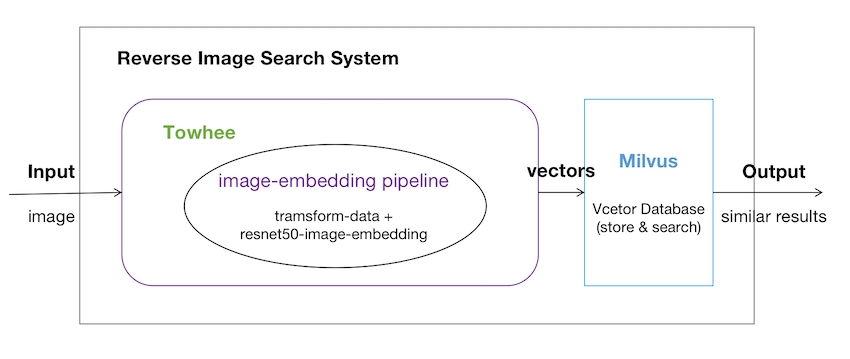

## Reverse image search

### Overview

**Reverse image search** helps you search for similar or related images using an input photo. Reverse image search is a [content-based image retrieval](https://en.wikipedia.org/wiki/Content-based_image_retrieval) (CBIR) query technique that involves providing the CBIR system with a sample image that it will then base its search upon.[1] Unlike the traditional image search that relies on labels to do the query, the reverse image search is based on the content of the image itself.

The applications of reverse image search include **finding the original source of an image**, **searching for similar materials, product search and recommendation.**

- **Find the source**

Search for the exact same image, often to find the original source of the image, or a low-resolution thumbnail.

- **Get the similar image**

Find similar pictures based on the photos taken, helping designers and staff find similar works faster and more efficiently.

- **Product recommendation**

Search for product images taken by users on the e-commerce platform to find the same or similar products, and recommend related products, improving the convenience of searching, and optimizing user experience.

These reverse image search applications are the most common in various fields, but how to analyze images efficiently and accurately still has questions. Are the searched image results satisfactory? Is search efficient when it has a large amount of data? Or is there a unified plan for these applications? What technology is needed to achieve it?

### Key technologies

With the quick development of AI technology, there are more and more methods to processing unstructured data, and the reverse image search application above can be realized with AI models. Before processing with the models, the image data needs to be pre-processed or transformed. And in the scenarios of reverser image search, model is usually used to extract image feature vectors, and after getting the feature vectors, we can store it and query with vector database.

- **Image transformation**

It's very important to do image data pre-processing and transform, including cropping, normalization, data enhancement, data convention(convert image data into a uniform data format, such as PIL.Image,tensor) etc. It will archive better image analysis after image transformation.

- **Embedding models**

Models are used to extract feature vectors of images, which is the most critical technique in CBIR systems. The vector of image may be visual features such as color, texture, shape, or spatial relationships. And the models are usually trained with deep neural networks on a large number of datasets, and it can gratefully represent the information of image.

- **Vector database**

In order to achieve a wonderful reverse image search system, effective search tools are very important. When dealing with very large vectors, using exact search methods will make the system very slow. So we need a vector database that can build an index for faster search, and also safely store the data.

### Solutions

As mentioned in the key technology section, the reverse image search system mainly includes three parts:

1. Transform image data into a normalized format.
2. Extract the feature vector of image through AI model.
3. Store the vector of the image in the vector database, then search for similar results.

As shown in the figure above, the first two steps can be achieved by [Towhee](http://towhee.io)[2]. **Towhee is an open source deep learning platform** that can help process various unstructured data, such as images, audio, video, etc., while integrating a variety of image processing models, such as image feature extraction, image classification, target detection, etc. The image embedding pipeline in the figure is based on the ResNet50 model. Of course, the model in Pipeline can also be customized by users.

And **[Milvus](http://milvus.io)**[3] **is an open source vector database** that can achieve millisecond-level responses of hundreds of millions of data and complete efficient data analysis. It contains a variety of index and metrics of vectors, which can meet the various computing needs of users for vectors.

So we use Milvus to store and analyze the image feature vectors extracted by Towhee. Though **Towhee + Milvus,** which can create a perfect picture search system.

### Resource

In the reverse image search system, image feature extraction can be achieved through Towhee's Pipeline, such as [image-embedding-resnet50](https://hub.towhee.io/towhee/image-embedding-resnet50), which includes two main operators: [transform image](https://hub.towhee.io/towhee/transform-image-operator-template) (implemented as [towhee/transform-image](https://hub.towhee.io/towhee/transform-image)) and [image embedding](https://hub.towhee.io/towhee/image-embedding-operator-template) (implemented as [towhee/resnet50-image-embedding](https://hub.towhee.io/towhee/resnet50-image-embedding))

### Reference

[1] https://en.wikipedia.org/wiki/Reverse_image_search

[2]https://github.com/towhee-io/towhee

[3]https://github.com/milvus-io/milvus
